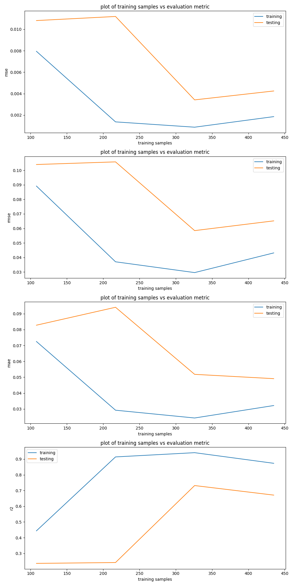
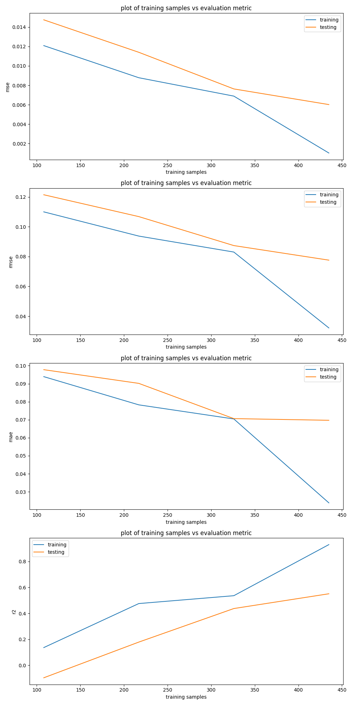

# CPSC 589 Robot Learning Assignment 1 Report

## Collaborators
Eason Ding

Chuhan Li

Anushka Potdar

## Target Behaviors

1. Be near the goal
2. Be near the goal and avoid the decoys
3. Primarily be near the goal and secondarily be near the decoy

## Algorithms Implemented

### [TAMER](https://www.researchgate.net/publication/220916820_Interactively_shaping_agents_via_human_reinforcement_the_TAMER_framework)
#### Intro
Tamer models the human reinforcement and uses this model to choose actions expected to be the most reinforced. 
It is originally an online learning framework where human feedback will be reflected in real time; 
our implementation is a simplified version of this framework where human preference for each state is known beforehand and can be modeled offline.

#### Data Modification and Training
Our model has an input dimension of 22 (7d joint angles + 3d goal position + 4 * 3d decoy positions) and an output dimension 3 (3 behaviors).
Human preferences are defined as the 3 target behaviors above, so rewards for each set of 7 joint angles can be calculated in advance (equations shown below).
They are given in terms of distance between the end effector and the goal as well as distance between the end effector and the decoys, 
and used as ground truth in training. The end effector position are transformed from with respect to the robot base to be with respect to the world by [-0.2, -0.5, 1.021].

#### Execution
After training, each output of the model corresponds to a reward predicted for a behavior. We formalized our next step prediction as a search problem.
There are 3 actions that could be taken for each joint: decrease angle, idle, increase angle; there are 7 joints in total.
So our search space has 3^7 possible action combinations. By randomly sampling 80% of all the combinations, 
we select the best one according to our model output. The plan and execute script is adapted from the xarmJointPlanningClient provided to execute demo trajectories.
The policy publisher contains 3 callback functions where joint_callback() is invoked whenever a new message is received from the '/joint_states' topic, 
and policy_callback() and eef_callback() are invoked based on a set timer. 

### [Bayesian IRL](https://www.researchgate.net/publication/220815343_Bayesian_Inverse_Reinforcement_Learning)

#### Intro
BIRL integrates prior knowledge with observed expert actions to derive a probability distribution over reward functions $P(reward | Demonstration)$.

#### Data Modification and Training
By assuming $P(reward)$ and $P(D)$ to be uniform, we aim to calculate $P(Demonstration | reward)$. Since we are training for the same 3 behaviors,
we are using the pre-calculated human reward to be the expert reward. For unseen 

Bayesian IRL aims to generate a probability distribution over the sapce of reward functions using Inverse Reinforcement Learning. In other words, this method focuses on inferring $P(reward | Demonstration)$. However, BIRL assumes that the expert has the attention to maximize the reward function of the given behavior, and since the provided demonstrations do not explicitly exhibit behaviors such as object avoiding, I will slightly modify the BIRL to make it suitable for my task. First, I assume $P(reward)$ and $P(D)$ is uniform, so that I only need to calculate $P(Demonstration | reward)$. Second, since I've already assigned human reward for all the demonstrations from previous task, I can approximate $P(Demonstration| reward)$ by using the expert reward (the ground truth $\hat{R}$) and the proposed reward ($\tilde{R}$). In my case, $P(Demonstration| reward) = e^{-(\hat{R} - \tilde{R})^2}$. Since the expert reward only covers states that is in the demonstration, I would need to train an MLP that could generate expert reward for all the states. Lastly, the robot will need to do online approximation of $\hat{R}$ using $\tilde{R}$, and use $\tilde{R}$ to guide its behavior.

#### Comparison

Both TAMER and BIRL are trying to approximate expert's reward for state-action pairs. However, BIRL focuses on the exact reward given by the expert, while BIRL focuses on inferring unknown reward from demonstration in a probabilistic way.

I choose these two algorithms because I want to compare the performance of RL and IRL in general.

For this specific assignment, I believe TAMER will have better performance, since TAMER only cares about human reward to different states and does not rely on expert's demonstration. In comparison, BIRL has the assumption that the expert demonstration tries to maximize the unknown reward function, which is not suitable for this task where I want to train the robot to learn new behaviors that's not demonstrated by the expert.

### Feedback to the trajectories

First, I convert the joint-space poses to end-effector poses, and record it as [here](eefPlanning).

Then, Let $G$ be the goal position, $E$ be the end-deffector position, and $D_i$ be the $i$ th decoy position, I assign reward to different states for different behaviors as follow:

1. Behavior 1: $e^{-\sqrt{(G - E)^2}}$
2. Behavior 2: $e^{-(\sqrt{(G - E)^2} - 0.2 \sum_i \sqrt{(D_i - E)^2})}$
3. Behavior 3: $e^{-(\sqrt{(G - E)^2} + 0.2 \sum_i \sqrt{(D_i - E)^2})}$

This reward make sense since it grows as the end-effector approaches the goal or attractors, and it decreases when the end-effector approaches the obstacles.

However, there's one problem: the recorded end-effector position is with respect to the robot's base, and the recorded Goal and Deocy position is with respect to the world.

Thus, using Gazebo, I figured out Robot's base position with respect to the World is: $[-0.2, -0.5, 1.021]$

And by applying transforms, end-effector position with respect to the world is: $[-0.2 - \text{end-effector pos wrt robot base}.y, -0.5 + \text{end-effector pos wrt robot base}.x, 1.021 + \text{end-effector pos wrt robot base}.z]$

Table below is the recorded Goal and Decoy positions in different environments

|Env, Goal, Decoy| pos.x w.r.t the world | pos.y       | pos.z      |
|:--------------:|:---------------------:|:-----------:|:----------:|
|Env 1, Goal 1   |-0.035		 |0.142        |1.245	    |
|Env 1, Goal 2   |-0.15			 |0.142	       |1.245       |
|Env 1, Goal 3   |-0.266		 |0.142	       |1.245       |
|Env 1, Goal 4   |-0.383		 |0.142        |1.245	    |
|Env 1, Decoy 1  |-0.383379              |0.165331     |1.14576     |
|Env 1, Decoy 2  |-0.183635		 |0.239076     |1.31077     |
|Env 1, Decoy 3  |-0.153111              |0.110957     |1.29395     |
|Env 1, Decoy 4  |0.022497	  	 |0.180345     |1.1708      |
|Env 2, Goal 1   |-0.035		 |0.042        |1.345	    |
|Env 2, Goal 2   |-0.15			 |0.042	       |1.245       |
|Env 2, Goal 3   |-0.266		 |0.142	       |1.345       |
|Env 2, Goal 4   |-0.383		 |0.042        |1.245	    |
|Env 2, Decoy 1  |-0.416498              |0.078665     |1.32583     |
|Env 2, Decoy 2  |-0.196313		 |0.310306     |1.34149     |
|Env 2, Decoy 3  |-0.133594              |0.184351     |1.34316     |
|Env 2, Decoy 4  |-0.074792	  	 |0.148929     |1.43017     |
|Env 3, Goal 1   |-0.035		 |0.042        |1.145	    |
|Env 3, Goal 2   |-0.15			 |0.142	       |1.245       |
|Env 3, Goal 3   |-0.266		 |0.142	       |1.245       |
|Env 3, Goal 4   |-0.383		 |0.042        |1.145	    |
|Env 3, Decoy 1  |-0.344683              |0.024459     |1.20518     |
|Env 3, Decoy 2  |-0.16924		 |0.226221     |1.2826      |
|Env 3, Decoy 3  |-0.099357              |0.12819      |1.32999     |
|Env 3, Decoy 4  |-0.024455	  	 |0.073603     |1.2148      |

### Training and Testing result

#### TAMER

As we can see from the evaluation, the performance of the model gets better with more training samples. In general, I would recommend using TAMER if we want the robot to learn new behaviors that is not shown in by the expert's demonstration.

#### BIRL

As we can see from the evaluation, the performance of the model gets better with more training samples. In general, I would recommend BIRL if we want the robot to simply learn what is demonstrated by the human expert, and under the situations where $P(\text{Demonstration} | \text{reward})$ is easy to calculate.

#### Conclusion

The result is just what I expected for TAMER and BIRL.

# ReadMe

* The **[assign_reward](assign_reward)** folder contains the code to assign reward to end-effector trajectories. The assigned rewards are saved inside the **[reward](reward)** folder.
* The **[bayesianIRL](bayesianIRL)** folder contains 4 models that trained with different training size (108, 217, 326, 435 samples). Each model takes in 18 numbers as input, and output 3 numbers that correspond to the rewards calculated for 3 different behaviors. **[bayesianIRL.py](bayesianIRL/bayesianIRL.py)** contains the code to run the BIRL policy. **[display.py](bayesianIRL/display.py)** contains the code to display the training and testing evaluation. **[train.py](bayesianIRL/train.py)** contains the code that trains the model.
* The **[config](config)** folder contains the simulation models.
* The **[planning](planning)** folder contains the code to run the simulation and execute the expert trajectory. I modified the code inside **[xarmJointPlanningClient.py](planning/xarmJointPlanningClient.py)** so that it can save the end-effector position to **[eefPlanning](eefPlanning)** while executing the expert's trajectory.
* The **[tamer](tamer)** folder contains 4 models that trained with different training size (108, 217, 326, 435 samples). Each model takes in 18 numbers as input, and output 3 numbers that correspond to the rewards calculated for 3 different behaviors. **[tamer.py](tamer/tamer.py)** contains the code to run the TAMER policy. **[display.py](tamer/display.py)** contains the code to display the training and testing evaluation. **[train.py](tamer/train.py)** contains the code that trains the model.

