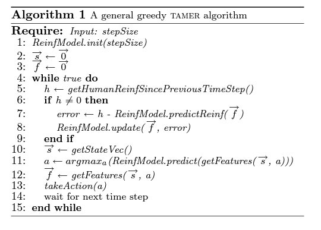
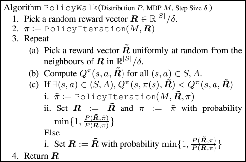

# RL assignment 1

Algoithm picked: 

TAMER framework

Bayesian IRL

Robot position with respect to the World: $[-0.2, -0.5, 1.021]$

End Effector position with respect to the world: [-0.2 - end_effector_pos.y, -0.5 + end_effector_pos.x, 1.021 + end_effector_pos.z]

|Env, Goal, Decoy| pos.x w.r.t the world | pos.y       | pos.z      |
|:--------------:|:---------------------:|:-----------:|:----------:|
|Env 1, Goal 1   |-0.035		 |0.142        |1.245	    |
|Env 1, Goal 2   |-0.15			 |0.142	       |1.245       |
|Env 1, Goal 3   |-0.266		 |0.142	       |1.245       |
|Env 1, Goal 4   |-0.383		 |0.142        |1.245	    |
|Env 1, Decoy 1  |-0.383379              |0.165331     |1.14576     |
|Env 1, Decoy 2  |-0.183635		 |0.239076     |1.31077     |
|Env 1, Decoy 3  |-0.153111              |0.110957     |1.29395     |
|Env 1, Decoy 4  |0.022497	  	 |0.180345     |1.1708      |
|Env 2, Goal 1   |-0.035		 |0.042        |1.345	    |
|Env 2, Goal 2   |-0.15			 |0.042	       |1.245       |
|Env 2, Goal 3   |-0.266		 |0.142	       |1.345       |
|Env 2, Goal 4   |-0.383		 |0.042        |1.245	    |
|Env 2, Decoy 1  |-0.416498              |0.078665     |1.32583     |
|Env 2, Decoy 2  |-0.196313		 |0.310306     |1.34149     |
|Env 2, Decoy 3  |-0.133594              |0.184351     |1.34316     |
|Env 2, Decoy 4  |-0.074792	  	 |0.148929     |1.43017     |
|Env 3, Goal 1   |-0.035		 |0.042        |1.145	    |
|Env 3, Goal 2   |-0.15			 |0.142	       |1.245       |
|Env 3, Goal 3   |-0.266		 |0.142	       |1.245       |
|Env 3, Goal 4   |-0.383		 |0.042        |1.145	    |
|Env 3, Decoy 1  |-0.344683              |0.024459     |1.20518     |
|Env 3, Decoy 2  |-0.16924		 |0.226221     |1.2826      |
|Env 3, Decoy 3  |-0.099357              |0.12819      |1.32999     |
|Env 3, Decoy 4  |-0.024455	  	 |0.073603     |1.2148      |

