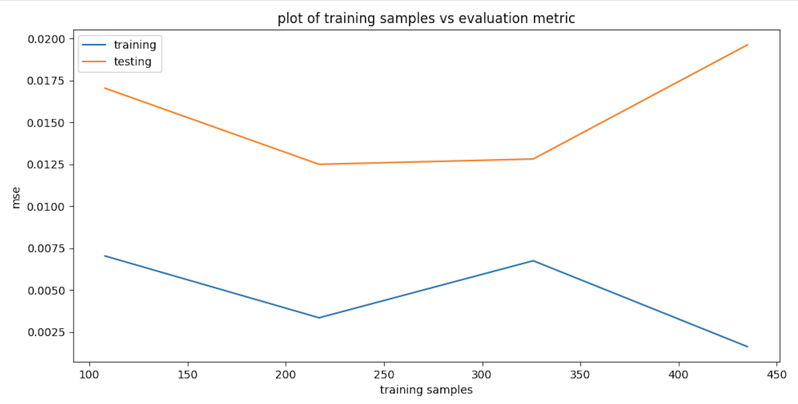

# CPSC 589 Robot Learning Assignment 1 Report

## Collaborators
Eason Ding

Chuhan Li

Anushka Potdar

## Target Behaviors

1. Be near the goal: $e^{-\sqrt{(G - E)^2}}$
2. Be near the goal and avoid the decoys: $e^{-(\sqrt{(G - E)^2} - 0.2 \sum_i \sqrt{(D_i - E)^2})}$
3. Primarily be near the goal and secondarily be near the decoy: $e^{-(\sqrt{(G - E)^2} + 0.2 \sum_i \sqrt{(D_i - E)^2})}$

where $G$ is the goal position, $E$ is the end effector position, and $D_i$ is the $i$ th decoy position.

## Algorithms Implemented

### [TAMER](https://www.researchgate.net/publication/220916820_Interactively_shaping_agents_via_human_reinforcement_the_TAMER_framework)
#### Intro
Tamer models the human reinforcement and uses this model to choose actions expected to be the most reinforced. 
It is originally an online learning framework where human feedback will be reflected in real time; 
our implementation is a simplified version of this framework where human preference for each state is known beforehand and can be modeled offline.

#### Data Modification and Training
Our model has an input dimension of 22 (7d joint angles + 3d goal position + 4 * 3d decoy positions) and an output dimension 3 (3 behaviors).
Human preferences are defined as the 3 target behaviors above, so rewards for each set of 7 joint angles can be calculated in advance (see equations above).
They are given in terms of distance between the end effector and the goal as well as distance between the end effector and the decoys, 
and used as ground truth in training. The end effector position are transformed from with respect to the robot base to be with respect to the world by [-0.2, -0.5, 1.021].

#### Execution
After training, each output of the model corresponds to a reward predicted for a behavior. We formalized our next step prediction as a search problem.
There are 3 actions that could be taken for each joint: decrease angle, idle, increase angle; there are 7 joints in total.
So our search space has 3^7 possible action combinations. By randomly sampling 80% of all the combinations, 
we select the best one according to our reward model output. The plan and execute script is adapted from the xarmJointPlanningClient provided to execute demo trajectories.
The policy publisher contains 3 callback functions where joint_callback() is invoked whenever a new message is received from the '/joint_states' topic, 
and policy_callback() and eef_callback() are invoked based on a set timer. In case of failed planning, we roll back to our last successful pose.

### [Bayesian IRL](https://www.researchgate.net/publication/220815343_Bayesian_Inverse_Reinforcement_Learning)

#### Intro
In BIRL, we invert the RL problem with Bayes' Rule: rather than finding a policy given a reward function, we try to find the reward function that most likely explains the observed behavior (expert's trajectory).
In other words, it integrates prior knowledge with observed expert actions to derive a probability distribution over reward functions; 
it applies Bayes' Rule to compute the posterior probability of a reward function given the observed demonstrations.

$P(reward | demonstration) = \frac{P(demonstration | reward) \times P(reward)}{P(demonstration)}$

#### Data Modification and Training

By assuming uniform priors for $P(reward)$ and $P(demonstration)$, the posterior is proportional to the likelihood P(reward | demonstration) ∝ P(demonstration | reward).
In our case, we define $P(demonstration | reward) = e^{-(\hat{R} - \tilde{R})^2}$ where $\hat{R}$ is our predefined expert reward (see equations above) 
and $\tilde{R}$ is our sampled from the reward space. For simplicity, we define our sampled reward to be 'current_reward + 0.25 * np.random.randn()'.
Since the demo trajectories are limited, we also train a MLP to model our expert reward function with rewards we computed for TAMER.

#### Execution

Like for TAMER, we also sample 80% of the 3^7 possible action combinations. For each sampled action, 
we sample rewards in the neighborhood of initial random reward by 'current_reward + 0.25 * np.random.randn()' 
and update our proposed reward iteratively as defined in the algorithm. 
We select the action with the highest proposed reward to perform. 

### Comparison & Hypothesis

Both TAMER and BIRL are RL frameworks that iteratively learn from demonstration/feedback. 
TAMER models the human reinforcement and learns directly from human feedback; BIRL's tries to infer the reward function with MDP. 
These two algorithms are chosen mostly because they seem to be the easiest to simplify and to implement. 
Between these two algorithms, TAMER would demonstrate a better performance because BIRL assumes the expert trajectories are rational and nearly optimal. However, 
the demo trajectories do not seem to be optimized for any obvious behavior pattern. This could lead to poor generalization result for BIRL.

## Result

#### TAMER

#### BIRL

We see an decrease in MSE in the training dataset but a increase in MSE in the testing dataset with more training samples.
Those the "tilt-up" would suggest overfitting, but together with the suboptimal performance in the recorded video, they might be suggesting
a lack of diversity in the training dataset and the model would benefit from more training samples with diverse behaviors.
I would recommend TAMER over BIRL in this case since BIRL depends more on rational and optimal expert demonstrations.
These results mostly align with my hypothesis and proposed explanation.

# ReadMe

1. Code: Please see [tamer/train.py](tamer/train.py) and [bayesianIRL/train.py](bayesianIRL/train.py) for training scripts; please see [tamer/tamer.py](tamer/tamer.py) and [bayesianIRL/bayesianIRL.py](bayesianIRL/bayesianIRL.py) for execution scripts.
2. Feedback Data: Please see [reward](reward) folder for rewards assigned to each set of joint angles in a trajectory.
3 rewards each corresponds to a behavior.
3. Video: Please see [video](demo_video.webm).
